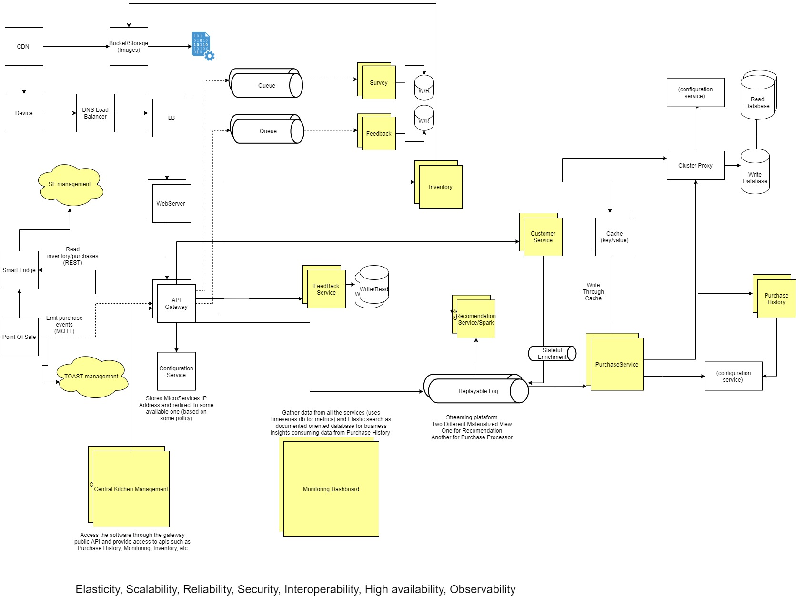
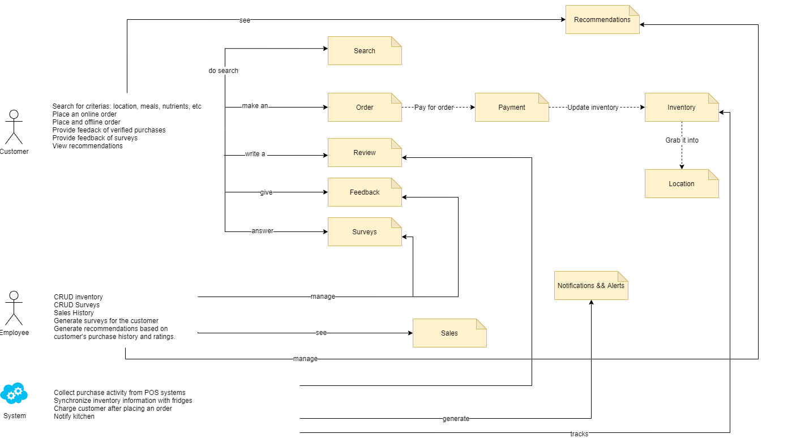

# Architectural Kata
O'Reilly Architectural Kata

**Team:** The Boyz
Integrants: 
* _Anyul Rivas._
* _Eduardo Raupp Pereira._
* _Javier Garcia Cotado._
* _Luiz Costa._
* _Simone Carcangiu._

## Components Diagram

## Requirements
* [Requirements](requirements/requirements.md)
* [Assumptions](requirements/assumptions.md)

### Architectural decisions

* [Data Consistency](adr/ADR1-data-consistency.md)
* [Microservice Architecture](adr/ADR2-microservices-architecture.md)
* [Replayable log](adr/ADR3-replayable-log.md)
* [Shared Database](adr/ADR4-shared-database.md)
* [Caching](adr/ADR5-caching.md)
* [UDP Protocol](adr/ADR6-udp-protocol.md)
* [Pub-Sub Messaging](adr/ADR7-pub-sub-messaging.md)
* [Communication between microservices](adr/ADR8-communication-between-microservices.md)
* [Queues](adr/ADR9-queue.md)
* [Bandwight usage](adr/ADR10-reducered-bandwidth.md)
* [Stateful store for Customer](adr/ADR11-replayable-log.md)
* [Content Delivery Network](adr/ADR13-cdn.md)
* [Config Service](adr/ADR12-Config-server.md)  
* [Operational reuse with Service Mesh](adr/ADR14-operational-reuse.md)  
* [Metrics](adr/ADR15-metrics.md)
* [Service Testability](adr/ADR16-services-testability.md)