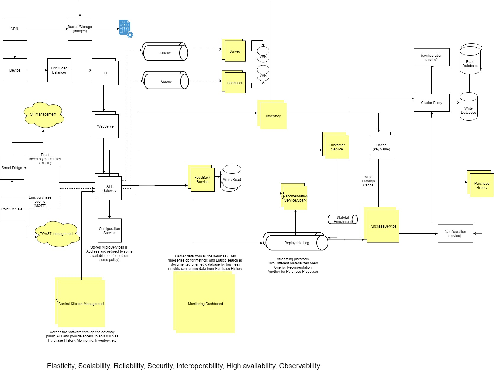
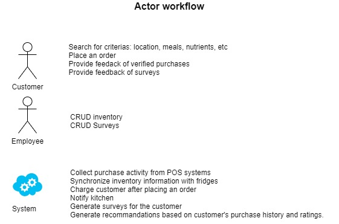

# Architectural Kata
O'Reilly Architectural Kata

## Components Diagram

### Architectural decisions

* [Data Consistency](ADR1-data-consistency.md)
* [Microservice Architecture](ADR2-microservices-architecture.md)
* [Replayable log](adr3-replayable-log.md)
* [Shared Database](adr4.shared-database.md)
* [Caching](adr5-caching.md)
* [UDP Protocol](adr6-udp-protocol.md)
* [Pub-Sub Messaging](adr7-pub-sub-messaging.md)
* [Communication between microservices](adr8-communication-between-microservices.md)
* [Queues](adr9-queue.md)
* [Bandwight usage](adr10-reducered-bandwidth.md)
* [Stateful store for Customer](ADR11-replayable-log.md)
* [Content Delivery Network](ADR13-cdn.md)
* [Config Service](ADR-12-Config-server.md)  
* [Tests](ADRXX-test.md)